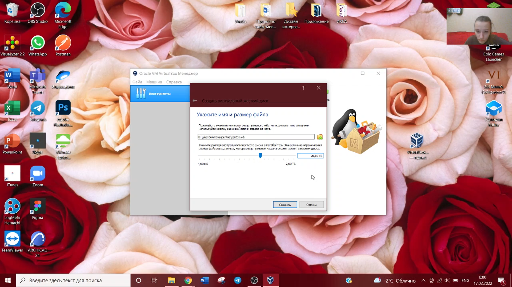

---
# Front matter
lang: ru-RU
title: "Отчет по лабораторной работе №1"
subtitle: "Информационная безопасноcть"
author: "Евдокимова Юлия Константиновна НПИбд-01-18"

# Formatting
toc-title: "Содержание"
toc: true # Table of contents
toc_depth: 2
lof: true # List of figures
fontsize: 12pt
linestretch: 1.5
papersize: a4paper
documentclass: scrreprt
polyglossia-lang: russian
polyglossia-otherlangs: english
mainfont: PT Serif
romanfont: PT Serif
sansfont: PT Sans
monofont: PT Mono
mainfontoptions: Ligatures=TeX
romanfontoptions: Ligatures=TeX
sansfontoptions: Ligatures=TeX,Scale=MatchLowercase
monofontoptions: Scale=MatchLowercase
indent: true
pdf-engine: lualatex
header-includes:
  - \linepenalty=10 # the penalty added to the badness of each line within a paragraph (no associated penalty node) Increasing the υalue makes tex try to haυe fewer lines in the paragraph.
  - \interlinepenalty=0 # υalue of the penalty (node) added after each line of a paragraph.
  - \hyphenpenalty=50 # the penalty for line breaking at an automatically inserted hyphen
  - \exhyphenpenalty=50 # the penalty for line breaking at an explicit hyphen
  - \binoppenalty=700 # the penalty for breaking a line at a binary operator
  - \relpenalty=500 # the penalty for breaking a line at a relation
  - \clubpenalty=150 # extra penalty for breaking after first line of a paragraph
  - \widowpenalty=150 # extra penalty for breaking before last line of a paragraph
  - \displaywidowpenalty=50 # extra penalty for breaking before last line before a display math
  - \brokenpenalty=100 # extra penalty for page breaking after a hyphenated line
  - \predisplaypenalty=10000 # penalty for breaking before a display
  - \postdisplaypenalty=0 # penalty for breaking after a display
  - \floatingpenalty = 20000 # penalty for splitting an insertion (can only be split footnote in standard LaTeX)
  - \raggedbottom # or \flushbottom
  - \usepackage{float} # keep figures where there are in the text
  - \usepackage{amsmath}
  - \floatplacement{figure}{H} # keep figures where there are in the text
---

# Цель работы

Целью работы является приобретение практических навыков установки операционной системы на виртуальную машину, настройки минимально необходимых для
дальнейшей работы сервисов.

# Задание

Установить и настроить CentOS на виртуальной машине на базе VirtualBox.

# Выполнение лабораторной работы

1. Создаю новую виртуальную машину и указываю имя виртуальной машины с типом операционной системы. Указала размер оперативной памяти виртуальной машины.

2. Задаю параметры жёсткого диска.

3. Задаю размер диска и путь к нему. 

4. Настраиваю новый привод оптических дисков и выбираю образ. 

5. Запускаем виртуальную машину и установку операционной системы.

6. Установливаем язык и раскладку клавиатуры. 

7. Имя машины: "ykevdokimova.localdomain". Часовой пояс: «Москва». Проведена первичная настройка.

8. Установлен root пароль.

9. Создан пользователь.

10. Установка операционной системы завершена, машина перезагружена. Установлен образ для работы с гостевой системой.

# Вывод
С приобрела практические навыки установки операционной системы на виртуальную машину, настройки минимально необходимые для дальнейшей работы сервисов.