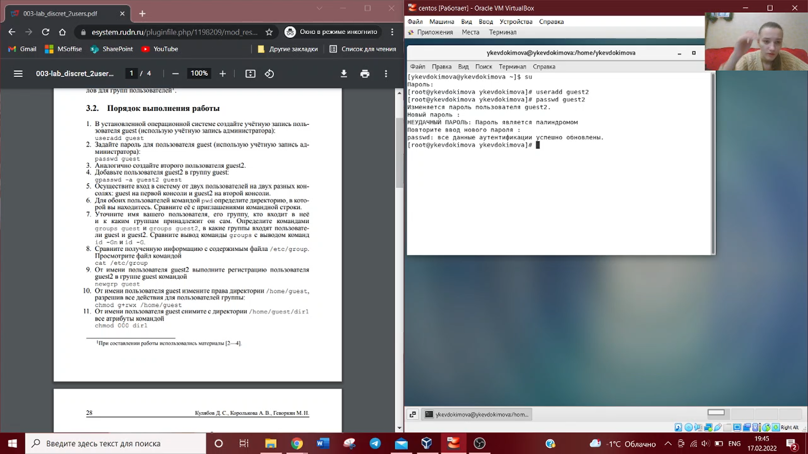
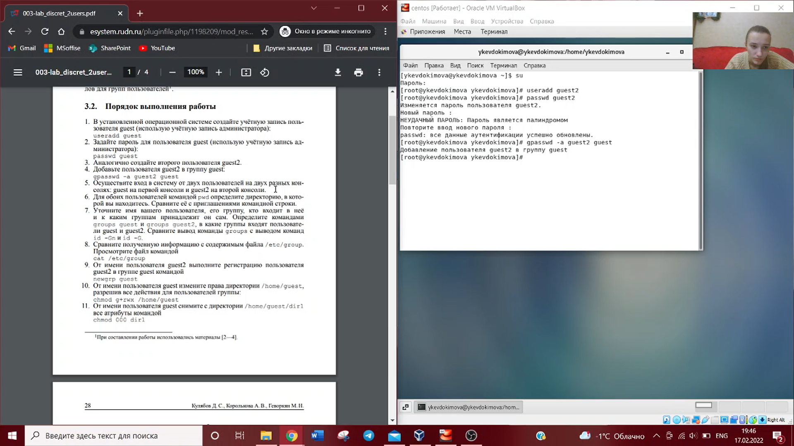
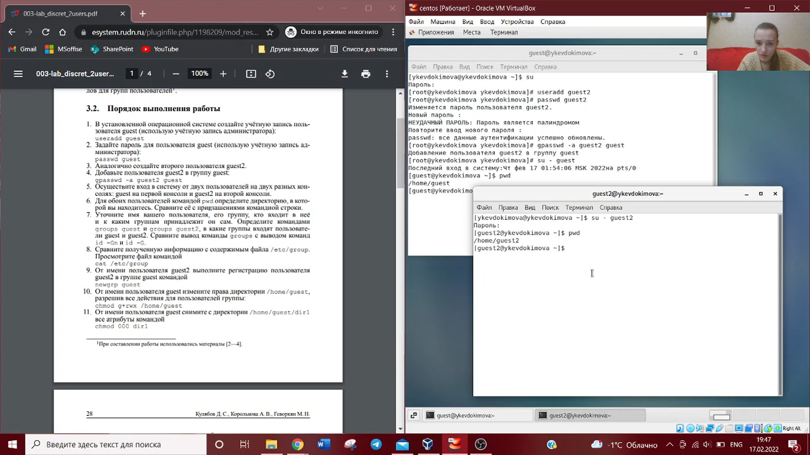
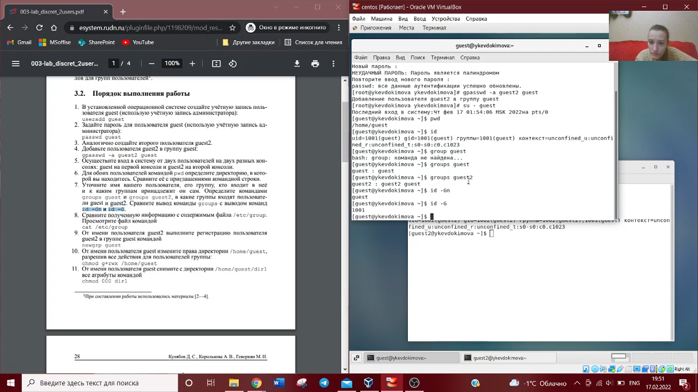
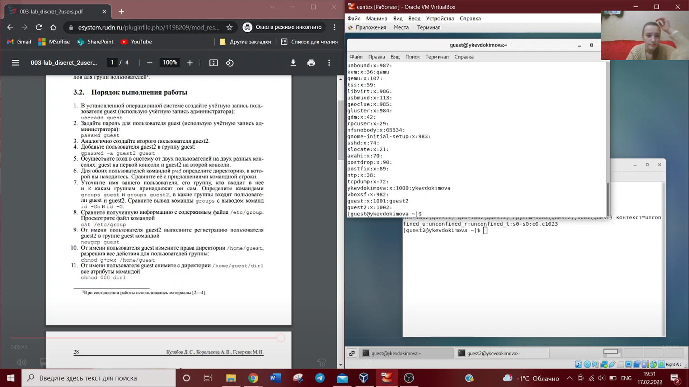
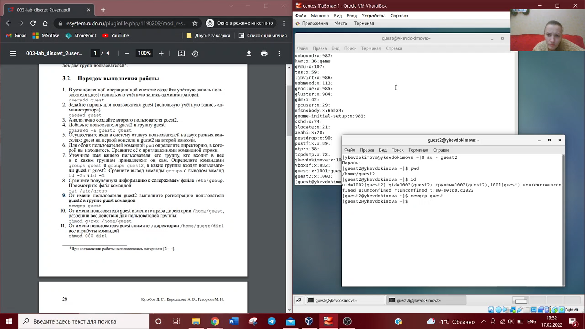

---
# Front matter
lang: ru-RU
title: "Отчет по лабораторной работе №3"
subtitle: "Информационная безопасность"
author: "Евдокимова Юлия Константиновна НПИбд-01-18"

# Formatting
toc-title: "Содержание"
toc: true # Table of contents
toc_depth: 2
lof: true # List of figures
lot: true # List of tables
fontsize: 12pt
linestretch: 1.5
papersize: a4paper
documentclass: scrreprt
polyglossia-lang: russian
polyglossia-otherlangs: english
mainfont: PT Serif
romanfont: PT Serif
sansfont: PT Sans
monofont: PT Mono
mainfontoptions: Ligatures=TeX
romanfontoptions: Ligatures=TeX
sansfontoptions: Ligatures=TeX,Scale=MatchLowercase
monofontoptions: Scale=MatchLowercase
indent: true
pdf-engine: lualatex
header-includes:
  - \linepenalty=10 # the penalty added to the badness of each line within a paragraph (no associated penalty node) Increasing the υalue makes tex try to haυe fewer lines in the paragraph.
  - \interlinepenalty=0 # υalue of the penalty (node) added after each line of a paragraph.
  - \hyphenpenalty=50 # the penalty for line breaking at an automatically inserted hyphen
  - \exhyphenpenalty=50 # the penalty for line breaking at an explicit hyphen
  - \binoppenalty=700 # the penalty for breaking a line at a binary operator
  - \relpenalty=500 # the penalty for breaking a line at a relation
  - \clubpenalty=150 # extra penalty for breaking after first line of a paragraph
  - \widowpenalty=150 # extra penalty for breaking before last line of a paragraph
  - \displaywidowpenalty=50 # extra penalty for breaking before last line before a display math
  - \brokenpenalty=100 # extra penalty for page breaking after a hyphenated line
  - \predisplaypenalty=10000 # penalty for breaking before a display
  - \postdisplaypenalty=0 # penalty for breaking after a display
  - \floatingpenalty = 20000 # penalty for splitting an insertion (can only be split footnote in standard LaTeX)
  - \raggedbottom # or \flushbottom
  - \usepackage{float} # keep figures where there are in the text
  - \usepackage{amsmath}
  - \floatplacement{figure}{H} # keep figures where there are in the text
---

# Цель работы

Получить практические навыки работы в консоли с атрибутами файлов для групп пользователей.

# Выполнение лабораторной работы

1.  В установленной операционной системе создала учетную запись пользователя guest (используя учетную запись администратора): useradd guest. Задала пароль для пользователя guest: passwd guest. (Это было выполнено в лабораторной работе №2) Аналогично создала второго пользователя guest2.

2. Добавила пользователя guest2 в группу guest: gpasswd -a guest2 guest. 

3. Осуществила вход в систему от двух пользователей на двух разных консолях: guest на первой консоли и guest2 на второй консоли. Для обоих пользователей командой pwd определила директорию, в которой мы находимся. 

4. Уточнила имя пользователя, его группу, кто входит в нее и к каким группам принадлежит он сам. Определила командами groups guest и groups guest2, в какие группы входят пользователи guest и guest2. Сравнила вывод команды groups с выводом команд id -Gn и id -G. Они не отличаются. 

5. Сравнила полученную информацию с содержимым файла /etc/group. Просмотрела файл командой
cat /etc/group.

6. От имени пользователя guest2 выполнила регистрацию пользователя guest2 в группе guest командой:
newgrp guest.

7. От имени пользователя guest изменила права директории /home/guest, разрешив все действия для пользователей группы: chmod g+rwx /home/guest. 

8. От имени пользователя guest сняла с директории /home/guest/dir1 все атрибуты командой
chmod 000 dir1. 

9. Заполнила таблицу «Установленные права и разрешенные действия для групп», определив, какие операции разрешены, а какие нет. Если операция разрешена, занесла в таблицу знак «+», если не разрешена, знак «-». Таблица прикреплена отдельным файлом в директории лабораторной работы.

11. На основании заполненной таблицы определила те или иные минимально необходимые права для выполнения пользователем guest2 операций внутри директории dir1 и заполнила таблицу «Минимальные права для совершения операций от имени пользователей входящих в группу». Таблица прикреплена отдельным файлом в директории лабораторной работы.

# Выводы
На основе проделанной работы получила практические навыки работы в консоли с атрибутами файлов для групп пользователей.