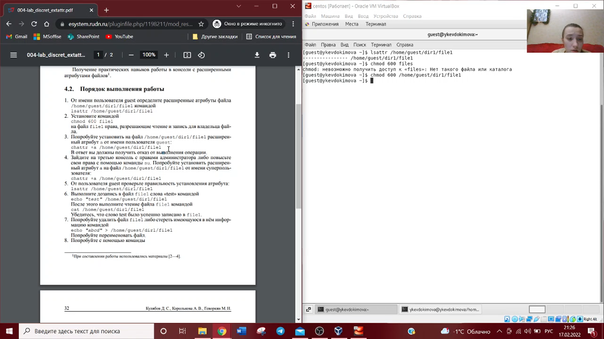
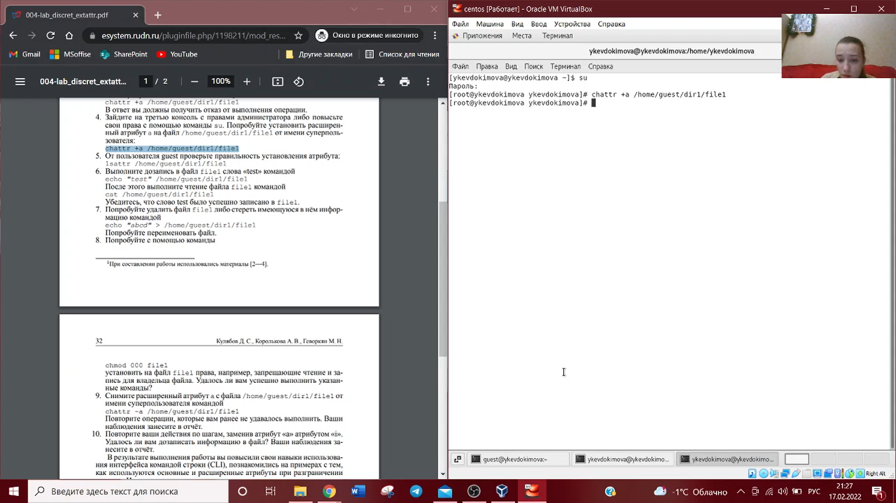
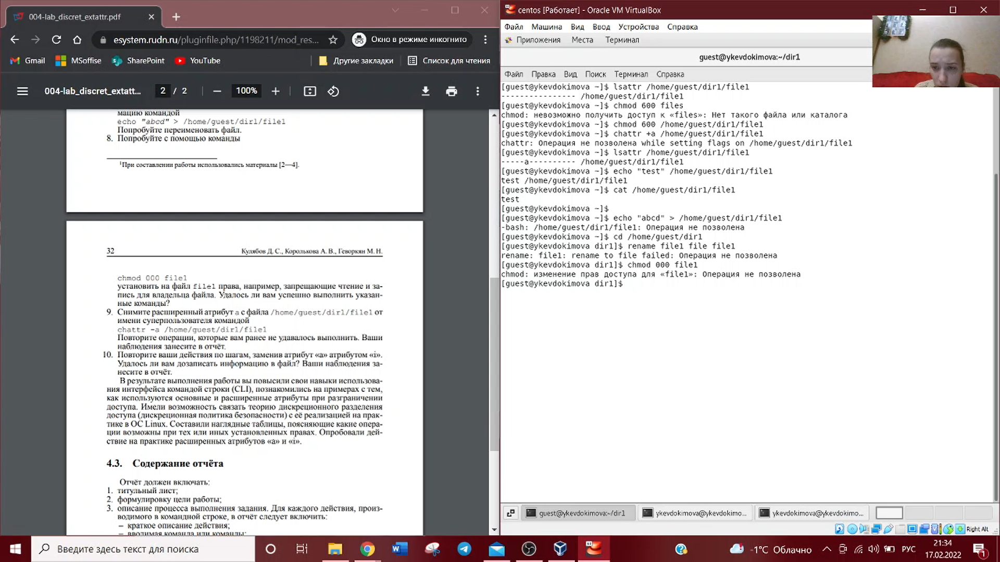
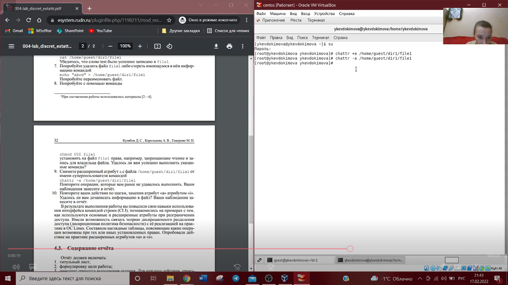
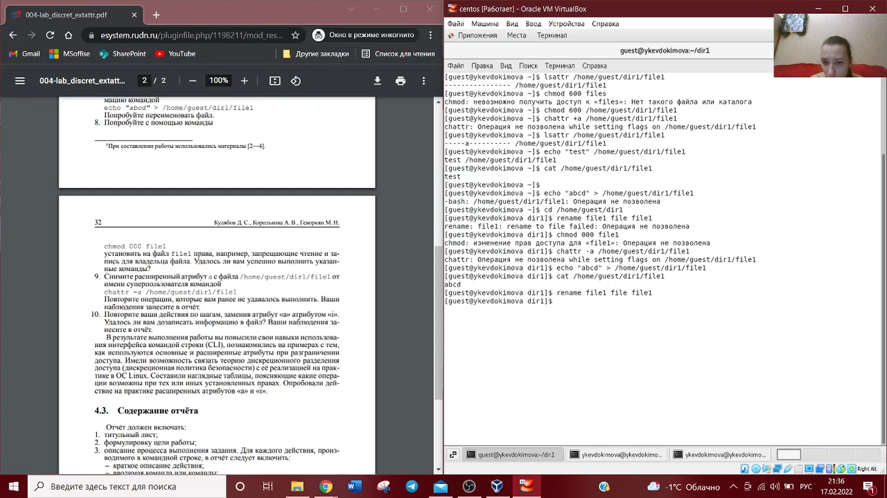
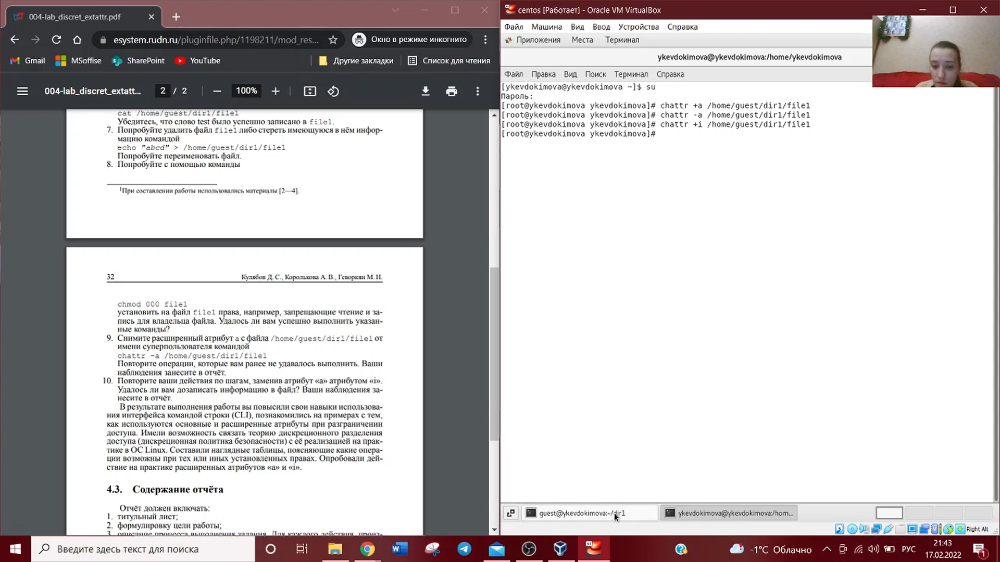
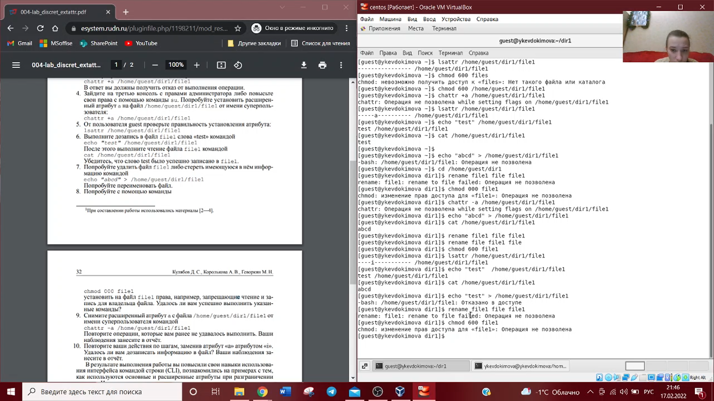

---
# Front matter
lang: ru-RU
title: "Отчет по лабораторной работе №4"
subtitle: "Информационная безопасность"
author: "Евдокимова Юлия Константиновна НПИбд-01-18"

# Formatting
toc-title: "Содержание"
toc: true # Table of contents
toc_depth: 2
lof: true # List of figures
fontsize: 12pt
linestretch: 1.5
papersize: a4paper
documentclass: scrreprt
polyglossia-lang: russian
polyglossia-otherlangs: english
mainfont: PT Serif
romanfont: PT Serif
sansfont: PT Sans
monofont: PT Mono
mainfontoptions: Ligatures=TeX
romanfontoptions: Ligatures=TeX
sansfontoptions: Ligatures=TeX,Scale=MatchLowercase
monofontoptions: Scale=MatchLowercase
indent: true
pdf-engine: lualatex
header-includes:
  - \linepenalty=10 # the penalty added to the badness of each line within a paragraph (no associated penalty node) Increasing the υalue makes tex try to haυe fewer lines in the paragraph.
  - \interlinepenalty=0 # υalue of the penalty (node) added after each line of a paragraph.
  - \hyphenpenalty=50 # the penalty for line breaking at an automatically inserted hyphen
  - \exhyphenpenalty=50 # the penalty for line breaking at an explicit hyphen
  - \binoppenalty=700 # the penalty for breaking a line at a binary operator
  - \relpenalty=500 # the penalty for breaking a line at a relation
  - \clubpenalty=150 # extra penalty for breaking after first line of a paragraph
  - \widowpenalty=150 # extra penalty for breaking before last line of a paragraph
  - \displaywidowpenalty=50 # extra penalty for breaking before last line before a display math
  - \brokenpenalty=100 # extra penalty for page breaking after a hyphenated line
  - \predisplaypenalty=10000 # penalty for breaking before a display
  - \postdisplaypenalty=0 # penalty for breaking after a display
  - \floatingpenalty = 20000 # penalty for splitting an insertion (can only be split footnote in standard LaTeX)
  - \raggedbottom # or \flushbottom
  - \usepackage{float} # keep figures where there are in the text
  - \usepackage{amsmath}
  - \floatplacement{figure}{H} # keep figures where there are in the text
---

# Цель работы

Получить практические навыки работы в консоли с расширенными атрибутами файлов.

# Выполнение лабораторной работы

1. От имени пользователя guest определила расширенные атрибуты файла /home/guest/dir1/file1. Установила командой: chmod 600 file1 на файл file1 права, разрешающие чтение и запись для владельца файла. Попробовала установить на файл /home/guest/dir1/file1 расширенный атрибут a от имени пользователя guest: chattr +a /home/guest/dir1/file1. В ответ мы получили отказ от выполнения операции.

2. Попробовала установить расширенный атрибут "a" на файл /home/guest/dir1/file1 от имени суперпользователя. 

3. От пользователя guest проверила правильность установления атрибута: lsattr /home/guest/dir1/file1. Выполнила дозапись в файл file1 слова «test» командой: echo "test" /home/guest/dir1/file1. После этого выполнила чтение файла file1 командой cat /home/guest/dir1/file1 и убедилась, что слово test успешно записано в file1. Попробовала удалить файл file1, стереть имеющуюся в нем информацию командой: echo "abcd" > /home/guest/dirl/file1 - не удалось. Попробовала переименовать файл - не удалось. Попробовала с помощью команды: chmod 000 file1 установить на файл file1 права, запрещающие чтение и запись для владельца файла - не удалось.

4. Сняла расширенный атрибут "a" с файла /home/guest/dirl/file1 от имени суперпользователя.

5. Повторила операции, которые ранее не удавалось выполнить. После снятия атрибута "а" мы можем выполнять все действия.

6. Установила расширенный атрибут "i" на файл /home/guest/dir1/file1 от имени суперпользователя.

7. Повторила по шагам наши операции. С установленным атрибутом "i"  нам не удается выполнить ни одного действия.

# Выводы

В результате выполнения работы я повысила свои навыки использования интерфейса командой строки (CLI), познакомилась на примерах с тем, как используются основные и расширенные атрибуты при разграничении доступа. Опробовала действие на практике расширенных атрибутов «а» и «i».