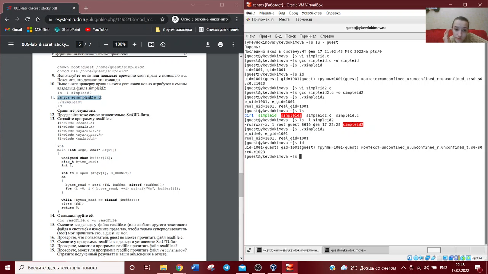

---
# Front matter
lang: ru-RU
title: "Отчет по лабораторной работе №5"
subtitle: "Информационная безопасность"
author: "Евдокимова Юлия Константиновна НПИбд-01-18"

# Formatting
toc-title: "Содержание"
toc: true # Table of contents
toc_depth: 2
lof: true # List of figures
fontsize: 12pt
linestretch: 1.5
papersize: a4paper
documentclass: scrreprt
polyglossia-lang: russian
polyglossia-otherlangs: english
mainfont: PT Serif
romanfont: PT Serif
sansfont: PT Sans
monofont: PT Mono
mainfontoptions: Ligatures=TeX
romanfontoptions: Ligatures=TeX
sansfontoptions: Ligatures=TeX,Scale=MatchLowercase
monofontoptions: Scale=MatchLowercase
indent: true
pdf-engine: lualatex
header-includes:
  - \linepenalty=10 # the penalty added to the badness of each line within a paragraph (no associated penalty node) Increasing the υalue makes tex try to haυe fewer lines in the paragraph.
  - \interlinepenalty=0 # υalue of the penalty (node) added after each line of a paragraph.
  - \hyphenpenalty=50 # the penalty for line breaking at an automatically inserted hyphen
  - \exhyphenpenalty=50 # the penalty for line breaking at an explicit hyphen
  - \binoppenalty=700 # the penalty for breaking a line at a binary operator
  - \relpenalty=500 # the penalty for breaking a line at a relation
  - \clubpenalty=150 # extra penalty for breaking after first line of a paragraph
  - \widowpenalty=150 # extra penalty for breaking before last line of a paragraph
  - \displaywidowpenalty=50 # extra penalty for breaking before last line before a display math
  - \brokenpenalty=100 # extra penalty for page breaking after a hyphenated line
  - \predisplaypenalty=10000 # penalty for breaking before a display
  - \postdisplaypenalty=0 # penalty for breaking after a display
  - \floatingpenalty = 20000 # penalty for splitting an insertion (can only be split footnote in standard LaTeX)
  - \raggedbottom # or \flushbottom
  - \usepackage{float} # keep figures where there are in the text
  - \usepackage{amsmath}
  - \floatplacement{figure}{H} # keep figures where there are in the text
---

# Цель работы

Изучить механизмы изменения идентификаторов, применение SetUID- и Sticky-битов. Получить практические навыки работы в консоли с дополнительными атрибутами. Рассмотреть работу механизма смены идентификатора процессов пользователей, а также влияние бита Sticky на запись и удаление файлов. 

# Выполнение лабораторной работы

1. Вошла в систему от имени пользователя guest,  создала программу simpleid.c. 

2. Скомплировала программу и убедилась, что файл программы создан: gcc simpleid.c -o simpleid. Выполнила программу simpleid: ./simpleid. Выполнила системную программу id. И сравнила полученный результат с данными предыдущего пункта задания. Данные не отличаются. 

3. Усложнила программу, добавив вывод действительных идентификаторов.

4. Скомпилировала и запустила simpleid2.c: gcc simpleid2.c -o simpleid2; ./simpleid2. 

5. От имени суперпользователя выполнила команды: chown root:guest /home/guest/simpleid2; chmod u+s /home/guest/simpleid2.

С помощью первой команды для файла simpleid2 мы поменяли пользователя и группу на root и guest соответственно. С помощью второй установили разрешение для владельца на выполнение с разрешением суперпользователя.

6. Выполнила проверку правильности установки новых атрибутов и смены владельца файла simpleid2: ls -l simpleid2. Запустила simpleid2 и id.

7. Создала и откомпилировала программу readfile.c. 

8. Сменила владельца у файла readfile.c и изменила права так, чтобы только суперпользователь мог прочитать его, a guest не мог. 

9. Проверила, что пользователь guest не может прочитать файл readfile.c.

10. Проверила, может ли программа readfile прочитать файл readfile.c (может), проверила, может ли программа readfile прочитать файл /etc/shadow (может). 

11. Выяснила, установлен ли атрибут Sticky на директории /tmp, для чего выполнила команду: ls -l / | grep tmp. От имени пользователя guest создала файл file01.txt в директории /tmp со словом test: echo "test" > /tmp/file01.txt. Просмотрела атрибуты у только что созданного файла и разрешила чтение и запись для категории пользователей «все остальные»: ls -l /tmp/file01.txt, chmod o+rw /tmp/file01.txt, ls -l /tmp/file01.txt. 

12. От пользователя guest2 (не являющегося владельцем) попробовала прочитать файл /tmp/file01.txt: cat /tmp/file01.txt, попробовала дозаписать в файл /tmp/file01.txt слово test2 командой: echo "test2" >> /tmp/file01.txt. Проверила содержимое файла командой: cat /tmp/file01.txt. Также попробовала записать в файл /tmp/file01.txt
слово test3, стерев при этом всю имеющуюся в файле информацию командой: echo "test3" > /tmp/file01.txt
От пользователя guest2 попробовала удалить файл /tmp/file01.txt командой: rm /tmp/fileOl.txt. (Все действия, кроме удаления файла, выполнить удалось). 

13. От суперпользователя выполнила команду, снимающую атрибут t (Sticky-бит) с директории /tmp: chmod -t /tmp. 

14. От пользователя guest2 проверила, что атрибута t у директории /tmp нет: ls -l / | grep tmp. Повторила предыдущие шаги. Нам удалось удалить файл от имени пользователя, не являющегося его владельцем, также получилось выполнить дозапись в файл и замену текста в файле. 

15. От суперпользователя вернула атрибут t на директорию /tmp: chmod +t /tmp. 

# Выводы

На основе проделанной работы я изучила механизмы изменения идентификаторов, применение SetUID- и Sticky-битов. Получла практические навыки работы в консоли с дополнительными атрибутами. Рассмотрела работу механизма смены идентификатора процессов пользователей, а также влияние бита Sticky на запись и удаление файлов.