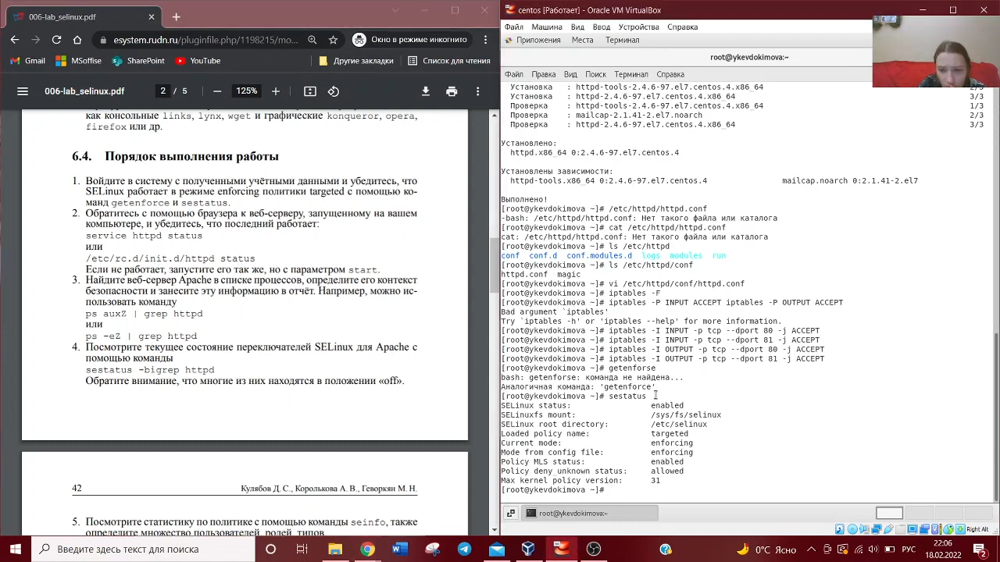
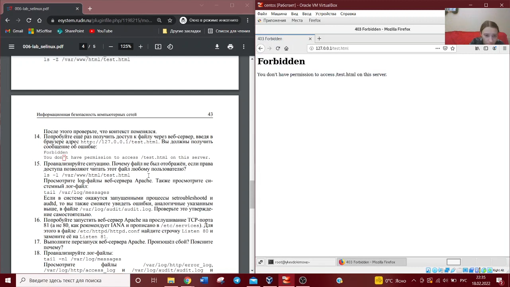
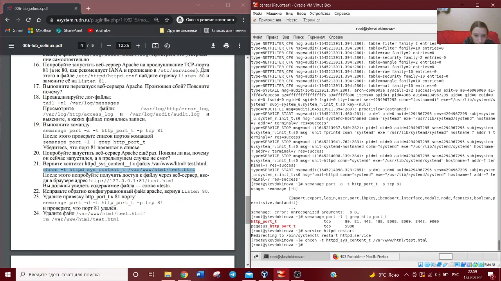
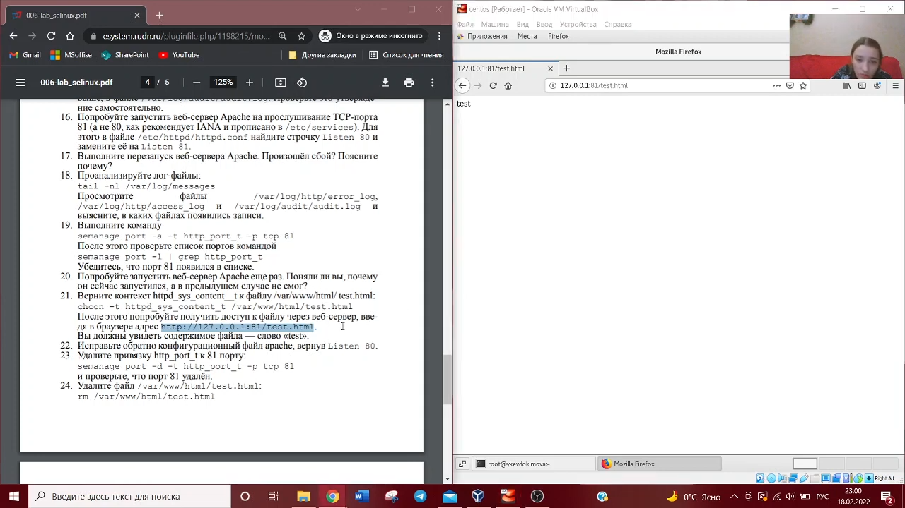

---
# Front matter
lang: ru-RU
title: "Отчет по лабораторной работе №6"
subtitle: "Информационная безопасность"
author: "Евдокимова Юлия Константиновна НПИбд-01-18"

# Formatting
toc-title: "Содержание"
toc: true # Table of contents
toc_depth: 2
lof: true # List of figures
fontsize: 12pt
linestretch: 1.5
papersize: a4paper
documentclass: scrreprt
polyglossia-lang: russian
polyglossia-otherlangs: english
mainfont: PT Serif
romanfont: PT Serif
sansfont: PT Sans
monofont: PT Mono
mainfontoptions: Ligatures=TeX
romanfontoptions: Ligatures=TeX
sansfontoptions: Ligatures=TeX,Scale=MatchLowercase
monofontoptions: Scale=MatchLowercase
indent: true
pdf-engine: lualatex
header-includes:
  - \linepenalty=10 # the penalty added to the badness of each line within a paragraph (no associated penalty node) Increasing the υalue makes tex try to haυe fewer lines in the paragraph.
  - \interlinepenalty=0 # υalue of the penalty (node) added after each line of a paragraph.
  - \hyphenpenalty=50 # the penalty for line breaking at an automatically inserted hyphen
  - \exhyphenpenalty=50 # the penalty for line breaking at an explicit hyphen
  - \binoppenalty=700 # the penalty for breaking a line at a binary operator
  - \relpenalty=500 # the penalty for breaking a line at a relation
  - \clubpenalty=150 # extra penalty for breaking after first line of a paragraph
  - \widowpenalty=150 # extra penalty for breaking before last line of a paragraph
  - \displaywidowpenalty=50 # extra penalty for breaking before last line before a display math
  - \brokenpenalty=100 # extra penalty for page breaking after a hyphenated line
  - \predisplaypenalty=10000 # penalty for breaking before a display
  - \postdisplaypenalty=0 # penalty for breaking after a display
  - \floatingpenalty = 20000 # penalty for splitting an insertion (can only be split footnote in standard LaTeX)
  - \raggedbottom # or \flushbottom
  - \usepackage{float} # keep figures where there are in the text
  - \usepackage{amsmath}
  - \floatplacement{figure}{H} # keep figures where there are in the text
---

# Цель работы

Развить навыки администрирования ОС Linux. Получить первое практическое знакомство с технологией SELinux. Проверить работу SELinx на практике совместно с веб-сервером Apache.

# Выполнение лабораторной работы

1. Вошла в систему с полученными учётными данными и убедилась, что SELinux работает в режиме enforcing политики targeted с помощью команд getenforce и sestatus.

2. Также проследила, чтобы пакетный фильтр был отключён или в своей рабочей конфигурации позволял подключаться к 80-у и 81-у портам протокола tcp. Отключила фильтр командами: iptables -F, iptables -P INPUT ACCEPT iptables -P OUTPUT ACCEPT. Так же добавила разрешающие правила.

3. Вошла в систему с полученными учётными данными и убедилась, что SELinux работает в режиме enforcing политики targeted с помощью команд getenforce и sestatus.

4. Убедилась, что сервер работает: service httpd status.

5. Нашла веб-сервер Apache в списке процессов, определила его контекст безопасности.

6. Посмотрела текущее состояние переключателей SELinux для Apache с помощью команды: sestatus -bigrep httpd. Обратила внимание, что многие из них находятся в положении «off». 

7. Посмотрела статистику по политике с помощью команды seinfo, также определила множество пользователей, ролей, типов. Определила тип файлов и поддиректорий, находящихся в директории /var/www, с помощью команды: ls -lZ /var/www. Определила тип файлов, находящихся в директории /var/www/html: ls -lZ /var/www/html. Определила круг пользователей, которым разрешено создание файлов в директории /var/www/html. 

8. Создала от имени суперпользователя (так как в дистрибутиве после установки только ему разрешена запись в директорию) html-файл /var/www/html/test.html. 

9. Проверила контекст созданного файла. httpd_sys_content_t. 

10. Обратилась к файлу через веб-сервер, введя в браузере адрес http://127.0.0.1/test.html. Убедилась, что файл был успешно отображён. 

11. Изменила контекст файла /var/www/html/test.html с httpd_sys_content_t на samba_share_t. После этого проверила, что контекст поменялся. Попробовала ещё раз получить доступ к файлу через веб-сервер, введя в браузере адрес http://127.0.0.1/test.html. Получили сообщение об ошибке.

12. Проанализировала ситуацию. Файл не был отображён потому что мы изменили контекст файла. Просмотрела log-файлы веб-сервера Apache. Также просмотрела системный лог-файл: tail /var/log/messages. 

13. Попробовала запустить веб-сервер Apache на прослушивание ТСР-порта 81 (а не 80, как рекомендует IANA и прописано в /etc/services). Для этого в файле /etc/httpd/httpd.conf нашла строчку Listen 80 и замените её на Listen 81. 

14. Проанализиировала лог-файлы. Просмотрела файлы /var/log/http/error_log, /var/log/http/access_log и /var/log/audit/audit.log.

15. Выполнила команду: semanage port -a -t http_port_t -р tcp 81. После этого проверила список портов командой: semanage port -l | grep http_port_t. Убедилась, что порт 81 появился в списке.

16. Вернула контекст httpd_sys_cоntent__t к файлу /var/www/html/test.html: chcon -t httpd_sys_content_t /var/www/html/test.html. После этого попробовала получить доступ к файлу через веб-сервер, введя в браузере адрес http://127.0.0.1:81/test.html. Увидели содержимое файла — слово «test».

17. Исправила обратно конфигурационный файл apache, вернув Listen 80.

18. Удалила привязку http_port_t к 81 порту.

19. Удалила файл /var/www/html/test.html.

# Выводы
На основе проделанной работы развила навыки администрирования ОС Linux. Получила первое практическое знакомство с технологией SELinux. Проверила работу SELinx на практике совместно с веб-сервером Apache.