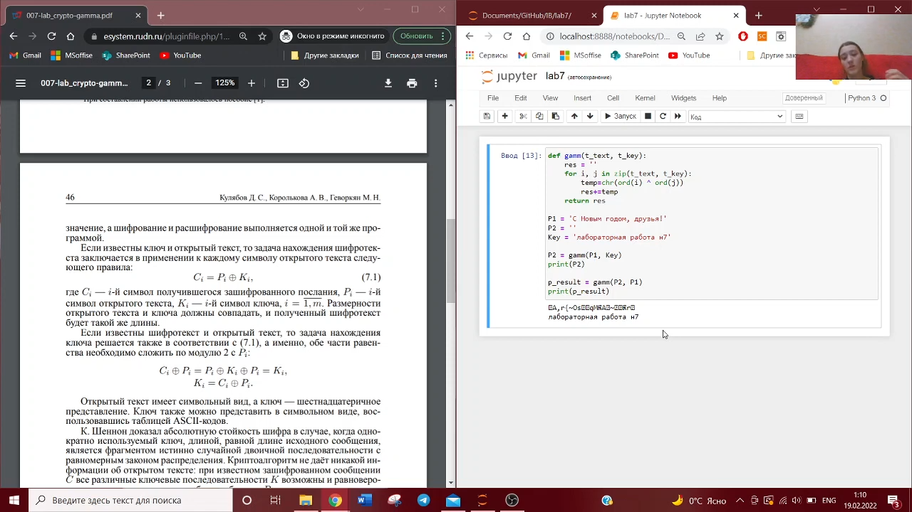
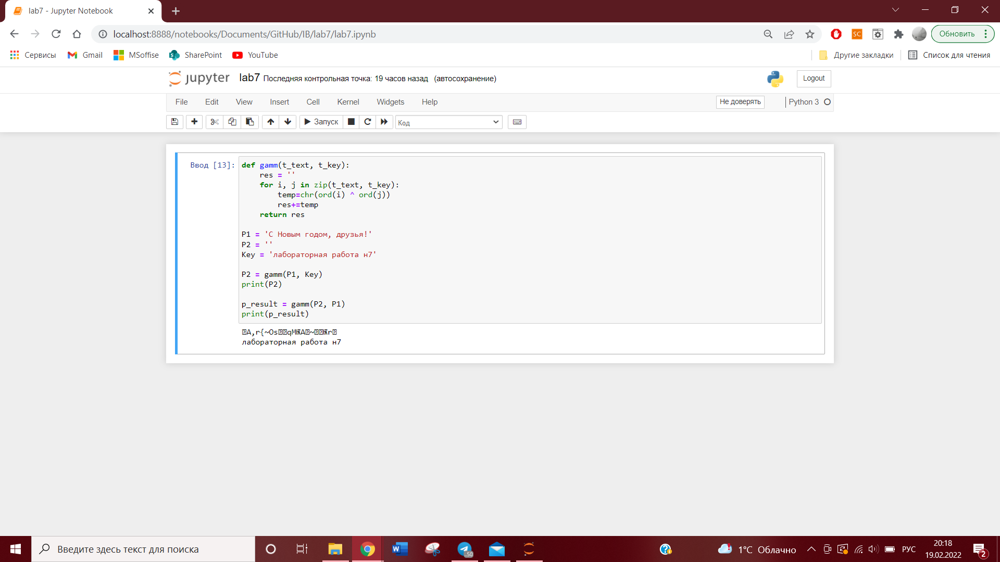

---
# Front matter
lang: ru-RU
title: "Отчет по лабораторной работе №7"
subtitle: "Информационная безопасность"
author: "Евдокимова Юлия Константиновна НПИбд-01-18"

# Formatting
toc-title: "Содержание"
toc: true # Table of contents
toc_depth: 2
lof: true # List of figures
fontsize: 12pt
linestretch: 1.5
papersize: a4paper
documentclass: scrreprt
polyglossia-lang: russian
polyglossia-otherlangs: english
mainfont: PT Serif
romanfont: PT Serif
sansfont: PT Sans
monofont: PT Mono
mainfontoptions: Ligatures=TeX
romanfontoptions: Ligatures=TeX
sansfontoptions: Ligatures=TeX,Scale=MatchLowercase
monofontoptions: Scale=MatchLowercase
indent: true
pdf-engine: lualatex
header-includes:
  - \linepenalty=10 # the penalty added to the badness of each line within a paragraph (no associated penalty node) Increasing the υalue makes tex try to haυe fewer lines in the paragraph.
  - \interlinepenalty=0 # υalue of the penalty (node) added after each line of a paragraph.
  - \hyphenpenalty=50 # the penalty for line breaking at an automatically inserted hyphen
  - \exhyphenpenalty=50 # the penalty for line breaking at an explicit hyphen
  - \binoppenalty=700 # the penalty for breaking a line at a binary operator
  - \relpenalty=500 # the penalty for breaking a line at a relation
  - \clubpenalty=150 # extra penalty for breaking after first line of a paragraph
  - \widowpenalty=150 # extra penalty for breaking before last line of a paragraph
  - \displaywidowpenalty=50 # extra penalty for breaking before last line before a display math
  - \brokenpenalty=100 # extra penalty for page breaking after a hyphenated line
  - \predisplaypenalty=10000 # penalty for breaking before a display
  - \postdisplaypenalty=0 # penalty for breaking after a display
  - \floatingpenalty = 20000 # penalty for splitting an insertion (can only be split footnote in standard LaTeX)
  - \raggedbottom # or \flushbottom
  - \usepackage{float} # keep figures where there are in the text
  - \usepackage{amsmath}
  - \floatplacement{figure}{H} # keep figures where there are in the text
---

# Цель работы

Освоить на практике применение режима однократного гаммирования.


# Выполнение лабораторной работы

1. Разработаем приложение на языке программирования python для шифрования и расшифрования данных методом однократного гаммирования.
Основная функция для гаммирования — gamm

2. После функции объявляем основные переменные.
P1 - Сообщение
P2 - шифротекст, который нужно получить
Key - Ключ для гаммирования из P1 в P2

3. Затем вызовем функцию гаммирования, чтобы найти шифротекст.

4. Повторно вызовем функцию гаммирования, но теперь для нахождения ключа из имеющихся сообщения и шифротекста.



```
def gamm(t_text, t_key):
    res = ''
    for i, j in zip(t_text, t_key):
        temp=chr(ord(i) ^ ord(j))
        res+=temp
    return res

P1 = 'С Новым годом, друзья!'
P2 = ''
Key = 'лабораторная работа н7'

P2 = gamm(P1, Key)
print(P2)

p_result = gamm(P2, P1)
print(p_result)
```

5. Вывод программы:



# Контрольные вопросы

1. Поясните смысл однократного гаммирования.
Смысл однократного гаммирования состоит в том, что каждый символ попарно с символом ключа побитово складываются по модулю.

2. Перечислите недостатки однократного гаммирования.
Недостатками является то, что ключ нельзя использовать повторно, а также размер ключа должен быть равен размеру текста и шифротекста.

3. Перечислите преимущества однократного гаммирования.
Основными преимуществами являются симметричность и криптостойкость. 

4. Почему длина открытого текста должна совпадать с длиной ключа?
Каждый символ открытого текста должен попарно складываться с символом ключа.

5. Какая операция используется в режиме однократного гаммирования, назовите её особенности?
В режиме однократного гаммирования используется сложение по модулю 2: при сложении чисел с другим получается исходное. Таблица истинности: 0+0 = 0, 0+1=1, 1+0=1, 1+1=0. Если в методе шифрования используется однократная вероятностная гамма той же длины, что и подлежащий сокрытию текст, то текст нельзя раскрыть.

6. Как по открытому тексту и ключу получить шифротекст?
Для этого необходимо сложить попарно символы текста с ключом по модулю 2.

7. Как по открытому тексту и шифротексту получить ключ?
Для этого необходимо сложить попарно по модулю 2 символы открытого текста с символами шифротекста.

8. В чём заключаются необходимые и достаточные условия абсолютной стойкости шифра?
Необходимые и достаточные условия абсолютной стойкости шифра заключаются в полной случайности ключа; равенстве длин ключа и открытого текста; использовании ключа однократно.


# Выводы

На основе проделанной работы освоила на практике применение режима однократного гаммирования.