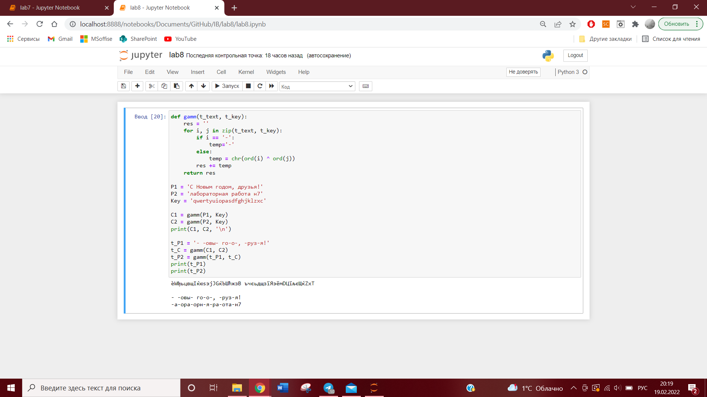

---
# Front matter
lang: ru-RU
title: "Отчет по лабораторной работе №8"
subtitle: "Информационная безопасность"
author: "Евдокимова Юлия Констинтиновна НПИбд-01-18"

# Formatting
toc-title: "Содержание"
toc: true # Table of contents
toc_depth: 2
lof: true # List of figures
fontsize: 12pt
linestretch: 1.5
papersize: a4paper
documentclass: scrreprt
polyglossia-lang: russian
polyglossia-otherlangs: english
mainfont: PT Serif
romanfont: PT Serif
sansfont: PT Sans
monofont: PT Mono
mainfontoptions: Ligatures=TeX
romanfontoptions: Ligatures=TeX
sansfontoptions: Ligatures=TeX,Scale=MatchLowercase
monofontoptions: Scale=MatchLowercase
indent: true
pdf-engine: lualatex
header-includes:
  - \linepenalty=10 # the penalty added to the badness of each line within a paragraph (no associated penalty node) Increasing the υalue makes tex try to haυe fewer lines in the paragraph.
  - \interlinepenalty=0 # υalue of the penalty (node) added after each line of a paragraph.
  - \hyphenpenalty=50 # the penalty for line breaking at an automatically inserted hyphen
  - \exhyphenpenalty=50 # the penalty for line breaking at an explicit hyphen
  - \binoppenalty=700 # the penalty for breaking a line at a binary operator
  - \relpenalty=500 # the penalty for breaking a line at a relation
  - \clubpenalty=150 # extra penalty for breaking after first line of a paragraph
  - \widowpenalty=150 # extra penalty for breaking before last line of a paragraph
  - \displaywidowpenalty=50 # extra penalty for breaking before last line before a display math
  - \brokenpenalty=100 # extra penalty for page breaking after a hyphenated line
  - \predisplaypenalty=10000 # penalty for breaking before a display
  - \postdisplaypenalty=0 # penalty for breaking after a display
  - \floatingpenalty = 20000 # penalty for splitting an insertion (can only be split footnote in standard LaTeX)
  - \raggedbottom # or \flushbottom
  - \usepackage{float} # keep figures where there are in the text
  - \usepackage{amsmath}
  - \floatplacement{figure}{H} # keep figures where there are in the text
---

# Цель работы

Освоить на практике применение режима однократного гаммирования на примере кодирования различных исходных текстов одним ключом.


# Выполнение лабораторной работы


1. Необходимо разработать приложение, позволяющее шифровать и дешифровать тексты P1 и P2. Приложение должно определить вид шифротекстов C1 и C2 обоих текстов при известном ключе.   

Для разработки используем наработки из лабораторной работы 7.
Старый код:
```
def gamm(t_text, t_key):
    res = ''
    for i, j in zip(t_text, t_key):
        temp=chr(ord(i) ^ ord(j))
        res+=temp
    return res

P1 = 'С Новым годом, друзья!'
P2 = ''
Key = 'лабораторная работа н7'

P2 = gamm(P1, Key)
print(P2)

p_result = gamm(P2, P1)
print(p_result)
```

Новый код:
```
def gamm(t_text, t_key):
    res = ''
    for i, j in zip(t_text, t_key):
        if i == '-':
            temp='-'
        else:
            temp = chr(ord(i) ^ ord(j))
        res += temp
    return res

P1 = 'С Новым годом, друзья!'
P2 = 'лабораторная работа н7'
Key = 'qwertyuiopasdfghjklzxc'

C1 = gamm(P1, Key)
C2 = gamm(P2, Key)
print(C1, C2, '\n')

t_P1 = '- -овы- го-о-, -руз-я!'
t_C = gamm(C1, C2)
t_P2 = gamm(t_P1, t_C)
print(t_P1)
print(t_P2)
```

1. В функцию gamm добавлена возможность игнорировать отмеченные минусом символы

2. Переменные P - два текста.   
Key - ключ  
C - шифротексты.

Злоумышленник знает часть текста - t_P1, шифротексты C1/C2     
t_C - результат гаммирования C1 и C2    
t_P2 - неизвестный текст 2, который в дальнейшем будет выяснен.

3. Задаем переменные

4. Гаммируем P1 и P2 по ключу, получаем C1 и C2

5. Злоумышленник знает C1 и C2, поэтому гаммирует их.

6. Затем злоумышленник гаммирует t_P1 по получившемуся значению, получает t_P2.

7. Теперь по имеющимся текстам можно подставить свои предположительные значения и гаммировать их по тому же значению, чтобы пошагово получать всё больше символов из P1 и P2. В данном случае будет достигнуто либо полное открытие всех символов обоих текстов, либо сужение круга возможных решений.

8. Вывод программы:



# Контрольные вопросы

1. Как, зная один из текстов ($P_1$ или $P_2$), определить другой, не зная при
этом ключа?  
По формуле $C_1 \oplus C_2 \oplus P_1 = P_1 \oplus P_2 \oplus P_1 = P_2$ 
 
2. Что будет при повторном использовании ключа при шифровании текста?  
Текст расшифруется.  

3. Как реализуется режим шифрования однократного гаммирования одним
ключом двух открытых текстов?  
по формулам режима однократного гаммирования:  
$$C_1 = P_1 \oplus K_1$$
$$C_2 = P_2 \oplus K_2$$
  
4. Перечислите недостатки шифрования одним ключом двух открытых
текстов.
- ключ, попав не в те руки, даст возможность злоумышленнику расшифровать оба текста;  
- можно расшифровать с помощью открытого текста другие известные шифротексты;  
- можно узнать часть текста, используя заранее известный шаблон и формат другого текста.  
  
5. Перечислите преимущества шифрования одним ключом двух открытых
текстов.
- скорость шифрования выше;  
- простой алгоритм шифрования;  
- шифротекст сильно меняется, если изменяется ключ или открытый текст.


# Выводы

На основе проделанной работы освоила на практике применение режима однократного гаммирования на примере кодирования различных исходных текстов одним ключом.